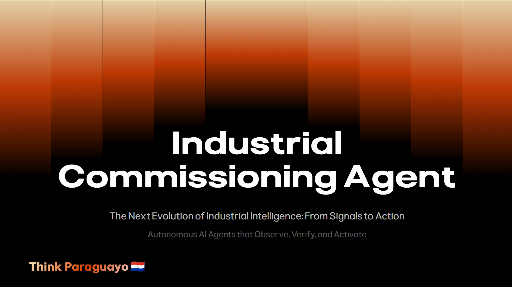
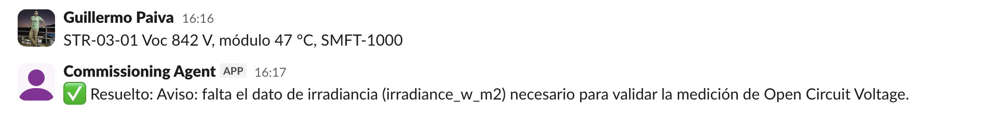
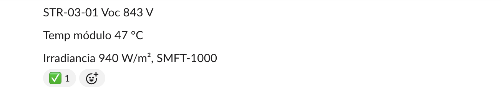
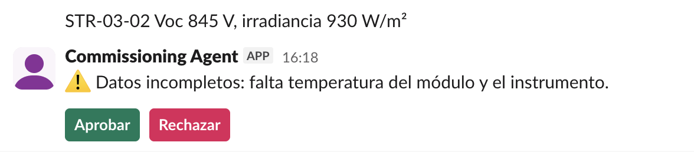
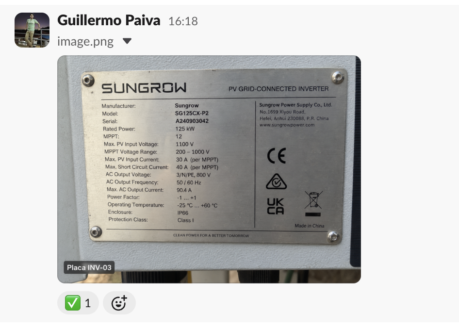
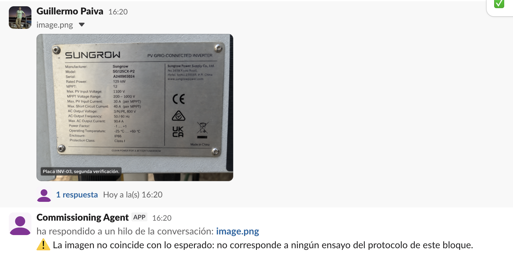
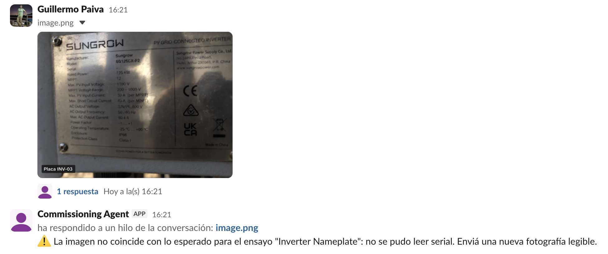

# Commissioning Agent



**A silent QA agent that lives in the Slack channel where solar-plant technicians already log their commissioning tests.** Nobody mentions it and nobody runs a command. It reads the ordinary field log, accumulates evidence across messages and photos, and speaks up only when the approved protocol says something is missing, invalid or wrong.

Built during the AI Tinkerers **"Agents, Everywhere"** global hackathon (San Lorenzo, September 12, 2026).

---

## For judges: where each criterion is answered

| Criterion | Where to look |
|---|---|
| **Core Requirements & Functionality** | [What the technician sees](#what-the-technician-sees) · [Reproduce it](#reproduce-it) · `npm run demo -- all` runs all 9 cases with no credentials |
| **Innovation & Theme Alignment** | [Why this only works inside Slack](#why-this-only-works-inside-slack) · [Agentic pattern](#agentic-pattern-signal-driven-agent-activation) |
| **Technical Execution & Integration** | [Architecture](#architecture) · [Failure handling](#failure-handling) · [Tests](#tests) |
| **Usefulness & Agentic Experience** | [The problem](#the-problem) · [Human control and authorization](#human-control-and-authorization) |

---

## The problem

Commissioning a photovoltaic block means seven controls per string and inverter: visual inspection, protective earth continuity, polarity, open-circuit voltage (Voc), short-circuit current (Isc), insulation resistance and inverter nameplate verification.

Technicians already report those results in a Slack channel per block, in free text, from a phone, often split across several messages. The protocol is strict about what makes a record valid:

- A Voc reading **without irradiance** cannot be accepted.
- A reading taken **below 700 W/m²** is recorded but invalid for acceptance.
- An inverter whose **serial does not match the design** is the wrong equipment.
- An **illegible nameplate photo** must never be interpreted; a new photo is required.

Today those gaps surface days later, during document review, when the technician has already left the site. The Commissioning Agent closes that loop **while the technician is still in front of the equipment**, without changing how they work.

---

## What the technician sees

| The technician posts in the block channel | The agent responds |
|---|---|
| `STR-03-02 Voc 845 V, irradiance 930 W/m², module 46 °C, SMFT-1000` | ⏳ while processing, then ✅ on the message. **No text.** |
| `STR-03-01 Voc 842 V, module 47 °C, SMFT-1000` | ⏳, then a finding card: missing irradiance, with **Approve / Reject** |
| Later, only `irradiance 940 W/m²` | The same card is updated to **✅ Resolved**, and ✅ lands on the completing message |
| A burst: `STR-03-01 Voc 843 V` · `Module temp 47 °C` · `Irradiance 940 W/m², SMFT-1000` | One accumulated record, ✅ on the last message only |
| `STR-03-01 Isc 13.1 A, irradiance 620 W/m², module 46 °C, SMFT-1000` | Finding: measurement conditions invalid. The Isc range is deliberately not evaluated |
| Photo of the inverter nameplate showing the planned serial | The vision model reads the serial, it equals the planned one, ✅ |
| Photo of a nameplate with a different serial | Finding: the observed serial does not match the planned equipment |
| A blurred photo, or a photo unrelated to the work | Reply: *"The image does not match the expected work…"*. Never a guessed value |
| The same unresolved finding observed again | Threaded reply: *"Finding already recorded (awaiting approval)"*. No duplicate action |
| No outcome within two minutes | ⏳ is replaced by ❌, and cleared if the outcome arrives later |
| Unrelated chat | A brief ⏳, then nothing |

Production technician-facing copy is localized for the crew; protocol field identifiers remain English machine identifiers.

### Screenshots: use-case mapping

These screenshots document the Slack demo. Their labels distinguish the
intended use case from what is actually visible in the interface.

#### Case 1 — Incomplete Voc: missing irradiance

The message includes `Voc`, module temperature, and an instrument, but no
irradiance. It is the missing-field finding that activates the agent.



#### Case 8 — Message burst ("spamming")

Three short messages—Voc, temperature, then irradiance and instrument—arrive
as a burst. The agent accumulates them by `channel + string + step` as one
test and adds ✅ only to the third message, with no warning.



#### Case 2 — Complete Voc

This screenshot shows the ✅ outcome for a complete Voc observation. The agent
accepts the measurement without posting a warning.


#### Case 3 — Incomplete record: missing temperature and instrument

This screenshot demonstrates the incomplete-record behavior, with two missing
fields:
`module_temp_c` and `instrument`.



#### Case 6 — Incorrect inverter nameplate

The `INV-03` nameplate shows the test serial ending in `042`, rather than the
expected serial ending in `024`; it is the nameplate-mismatch case.



#### Case 5 — Correct nameplate, with the association guardrail shown

The second verification belongs to the correct-nameplate case. However, the
screenshot shows the demo's real association guardrail: the photo was not
associated with a protocol test and the agent rejected it. It therefore is
**not** presented as proof of Case 5's expected silent ✅ outcome.



#### Case 7 — Unreadable photo

The nameplate is dark or reflective and its serial cannot be read. The agent
asks for a legible photo instead of inventing a value.



---

## Why this only works inside Slack

- **The input is the team's existing work log, not a prompt.** There is no @mention, no slash command and no form. The technician keeps working exactly as before.
- **The activation signal is the absence of required evidence.** A chatbot reacts to what is said. This agent reacts to what the protocol expected and nobody said.
- **Silence is a designed outcome.** ✅ with no message means *seen, validated, complete*. The agent stays out of a busy work channel unless the work is wrong.
- **Evidence arrives the way people actually produce it**: free text, bursts of short messages, late corrections and phone photos. The agent stitches them into one record per target and test.
- **Approval happens where the supervisor already reads the channel**, and each button is bound to one exact, persisted action.

None of that can be reproduced in a standalone chatbox, because the value comes from watching shared work that nobody is addressing to the agent.

---

## Agentic Pattern: Signal-Driven Agent Activation

Reference: <https://www.agentic-patterns.com/patterns/signal-driven-agent-activation/>

| Pattern element | Implementation |
|---|---|
| **Signal source** | Slack `message` events over Socket Mode, including `file_share` photos. Slack is the source, not the business logic. |
| **Normalization** | Slack payloads become a domain `NormalizedSignal` immediately in `src/signals/normalize.ts`. Nothing outside `src/surface/` depends on Slack shapes. |
| **Context** | `channel_bindings` resolves channel → block → protocol before any validation. |
| **Accumulation** | Observations persist in SQLite keyed by channel, target and step. Several messages become one observed state and survive restarts. |
| **Activation threshold** | When the evaluation window closes, the deterministic validator compares the accumulated state with the protocol. Activation happens only on a difference. |
| **Agent activation** | A proposed finding is written in Spanish and published behind human approval. |
| **Cooldown** | A repeated unresolved finding does not create a new action. It is answered in the thread of the new evidence instead. |
| **Kill switch** | `channel_bindings.enabled = false` stops every activation for that channel. |
| **Auditability** | Every activation traces to `processed_events` → `records` → validation result → `pending_actions` → `evidence`. |

### Our variation

In the canonical pattern, an incoming external signal often directly satisfies an activation threshold. In this implementation, incoming Slack activity updates observed work state. The activation condition is the deterministic difference between that accumulated observed state and the expected state defined by the commissioning protocol.

**The LLM does not detect absence. The deterministic protocol engine does.**

### Patterns demonstrably implemented

| Pattern | Where |
|---|---|
| Structured Output Specification | Zod schemas with `generateObject` in `src/agent/classify.ts`, `extract.ts` and `propose.ts`. The extraction schema is derived from the protocol YAML at runtime. |
| Human-in-the-Loop Approval Framework | Block Kit **Approve / Reject** in `src/surface/slack.ts`, with persisted transitions. |
| Exact-Action Authorization Binding | Each button carries the `pending_actions.id` it acts on. An approval for one finding can never approve another. |
| Visual AI Multimodal Integration | Slack photos are downloaded with the bot token and read by a vision model in `src/agent/extract.ts`. |

---

## Architecture

```mermaid
flowchart LR
  T[Technician posts in Slack<br/>text, burst or photo] --> S[Slack Socket Mode<br/>surface/slack.ts]
  S --> N[Normalize and dedupe<br/>processed_events]
  N --> C[Resolve context<br/>channel to block to protocol]
  C --> A{Exactly one open record<br/>gains a missing field?}
  A -- yes --> X[Extract with LLM or vision<br/>schema derived from YAML]
  A -- no --> L[Classify with LLM<br/>allowlisted targets and steps]
  L --> X
  X --> R[(Accumulate in SQLite<br/>evaluation_due_at)]
  R --> W[Evaluation window<br/>timer, sweep, startup recovery]
  W --> V{Deterministic validation<br/>required, condition, acceptance}
  V -- complete --> OK[Check reaction<br/>no message]
  V -- difference --> P[LLM wording in Spanish]
  P --> H[Approve or Reject<br/>bound to pending_action.id]
  H --> D[(Persisted state<br/>Slack message updated)]
```



### The sandwich: who decides what

| Stage | Decided by | Module |
|---|---|---|
| Ingestion, normalization, dedupe | Deterministic | `surface/slack.ts`, `signals/normalize.ts`, `domain/store.ts` |
| Target and step classification, from allowlisted ids and bounded open candidates | LLM | `agent/classify.ts` |
| Structured extraction, schema generated from the protocol step | LLM or vision | `agent/extract.ts` |
| Accumulation and evaluation window | Deterministic | `signals/accumulate.ts`, `signals/scheduler.ts` |
| Validation: required fields, then condition checks, then acceptance checks | Deterministic | `domain/validate.ts` |
| Activation, cooldown, kill switch | Deterministic | `signals/activation.ts`, `signals/cooldown.ts`, `signals/evaluate.ts` |
| Finding wording | LLM | `agent/propose.ts` |
| Approval | **Human** | Slack Block Kit |
| Write and Slack update | Deterministic | `domain/store.ts`, `index.ts` |

The model never decides whether a required field exists, whether a number is inside a range, whether two serials are equal, whether an action was approved, or whether an event was already processed.

### Code map

```text
src/
  index.ts              wiring: Slack connects first, then scheduler, service and health server
  app.ts                CommissioningService: dedupe, context, association, extraction, accumulation
  config.ts             startup validation of tokens, models, provider and paths
  surface/slack.ts      Bolt adapter: events, photo download, reactions, Block Kit, replies
  signals/              normalize, accumulate, activation, cooldown, evaluate, scheduler
  domain/               protocol loader, deterministic validator, SQLite store (the only writer)
  agent/                classify, extract, propose, provider selection (OpenRouter, OpenAI)
  demo/                 CLI runner and fixtures for the nine demo cases
  utils/                YAML loader, check functions, shared types
data/
  protocols/pv-string-verification.yaml   the approved protocol, as data
  plant-seed.yaml                         block, inverter, strings and channel binding
  documents/                              engineering references, never read at runtime
```

---

## Protocol as data

The protocol lives in `data/protocols/pv-string-verification.yaml`. The extractor, validator and activation logic are generic: adding a step or changing a limit is a YAML change, not a code change.

```yaml
- id: voc
  name: Open Circuit Voltage
  target_type: string
  requires: [voc_v, irradiance_w_m2, module_temp_c, instrument]
  checks:
    - { type: range, field: irradiance_w_m2, min: 700, phase: condition }
    - { type: range, field: voc_v, min: 802, max: 886, phase: acceptance }
```

Only three check types exist, as plain functions: `range`, `equals` and `exists_in`. There is no rules language and no expression evaluation.

Every check declares a phase. **If a condition check fails, acceptance checks are skipped**, so a technician is told the irradiance invalidated the measurement instead of receiving two contradictory findings.

Expected values come from an allowlist, not a path resolver. Today the only source is `equipment.serial_expected`.

| Step | Required fields | Checks |
|---|---|---|
| Visual inspection | `visual_check` | none |
| Protective earth continuity | `continuity_ohm`, `instrument` | ≤ 1 Ω |
| Polarity | `polarity` | value in `[correct]` |
| Voc | `voc_v`, `irradiance_w_m2`, `module_temp_c`, `instrument` | condition ≥ 700 W/m², acceptance 802–886 V |
| Isc | `isc_a`, `irradiance_w_m2`, `module_temp_c`, `instrument` | condition ≥ 700 W/m², acceptance 11–15 A |
| Insulation resistance | `insulation_mohm`, `instrument` | ≥ 1 MΩ |
| Inverter nameplate | `serial` | equals `equipment.serial_expected` |

---

## Failure handling

The system fails closed. When it cannot know something, it does not invent it.

| Situation | Behavior |
|---|---|
| Slack redelivers an event | `processed_events` guarantees each `event_id` is processed once, in SQLite rather than memory |
| Process restarts mid-window | `evaluation_due_at` is authoritative: in-process timer, periodic sweep every 15 s, and overdue recovery at startup |
| A field is not in the message | The extractor returns it as absent. Strict structured output requires every property, so absence is modeled as `null` and stripped, never filled |
| A continuation names neither target nor step | Associated deterministically only when exactly one open record gains a missing field; otherwise left to the classifier, and dropped if still ambiguous |
| A speculative extraction was made for the wrong step | Never reused. The observation is always extracted against the step actually resolved |
| A photo cannot be downloaded | Ignored before any model call, marked ❌. It is never classified from an empty message |
| A photo is blurred or unrelated | Replied to as *"does not match the expected work"* and never merged into a record as empty evidence |
| Vision provider is rate limited | A photo is read once, after the step is resolved, instead of once per open step |
| The same finding repeats | No duplicate action. A threaded reply references the existing one |
| No outcome within two minutes | ⏳ becomes ❌. The deadline stretches with the evaluation window, and a late outcome clears the mark |
| Model provider fails | No finding is created from missing model output; the error is logged with context |
| Channel disabled | Signals may arrive, but nothing activates |
| Socket Mode handshake stalls when heavy modules load first | Slack connects before the scheduler and service are loaded |

---

## Human control and authorization

- A finding is a **proposal** until a supervisor presses **Approve** or **Reject**.
- The button carries the exact `pending_actions.id`. The store transition is keyed on that id and records `approved_by` and timestamps.
- Every state change is persisted: `pending`, `approved`, `rejected`, `resolved`. **Deleting the Slack message does not erase the trace.**
- When late evidence completes a record, the open finding is resolved and the original Slack message is edited in place, instead of posting a new one.
- The agent can be switched off per channel without redeploying.

### Data model (SQLite)

| Table | Purpose |
|---|---|
| `equipment` | Inverters and strings per block, with the planned serial |
| `channel_bindings` | Channel → block → protocol, plus the kill switch |
| `records` | Accumulated observed state per target and step, evaluation status and due time |
| `evidence` | Photo metadata and Slack references. Files are never stored as blobs |
| `pending_actions` | Findings, proposed message, status, approver and resolution |
| `processed_events` | Dedupe of Slack `event_id` |

---

## Tech stack

| Layer | Choice |
|---|---|
| Language and runtime | TypeScript on Node.js |
| Environment integration | Slack Bolt in Socket Mode: events, file download, reactions, Block Kit, threaded replies, message updates |
| Model access | Vercel AI SDK `generateObject` with Zod schemas |
| Models used in the demo | `openai/gpt-oss-120b` for classification, extraction and wording; `qwen/qwen3.8-27b` for vision, served through OpenRouter |
| Provider switch | `AI_PROVIDER=openrouter` or `openai`, isolated in `src/agent/model.ts` |
| State | SQLite through `better-sqlite3` |
| Protocol | YAML |
| Tests | Vitest plus a CLI runner that exercises production layers |
| Packaging | Docker, with Google Cloud Run as the single-instance target |

**Sponsor technology.** `gpt-oss-120b` is OpenAI's open-weight model. OpenRouter is implemented as a provider option. Google Cloud Run is the documented deployment target.

---

## Reproduce it

### 1. Run the business loop with no credentials

```bash
npm install
npm test
npm run demo -- all
```

The runner pushes the nine demo cases through the real normalization, accumulation, SQLite store, validator and activation rule. Only the model outputs are fixtures, at the model boundary.

```text
CASE 1 — Missing irradiance

Target: STR-03-01
Step: voc

Observed:
✓ voc_v
✓ module_temp_c
✓ instrument
✗ irradiance_w_m2

Validation: INCOMPLETE
Activation: YES
Finding: missing irradiance_w_m2
PASS

9 passed
0 failed
```

Run a single case with `npm run demo -- case5`.

### 2. Create the Slack app

At api.slack.com/apps choose **From a manifest** and paste:

```yaml
display_information:
  name: Commissioning Agent
features:
  bot_user:
    display_name: Commissioning Agent
    always_online: true
oauth_config:
  scopes:
    bot:
      - chat:write
      - reactions:write
      - channels:history
      - files:read
settings:
  event_subscriptions:
    bot_events:
      - message.channels
  interactivity:
    is_enabled: true
  socket_mode_enabled: true
  org_deploy_enabled: false
  token_rotation_enabled: false
```

Install the app, generate an app-level token with `connections:write`, and invite the bot to the block channel.

### 3. Configure

```bash
cp .env.example .env
```

| Variable | Value |
|---|---|
| `SLACK_BOT_TOKEN` | Bot User OAuth Token, `xoxb-…` |
| `SLACK_APP_TOKEN` | App-level token, `xapp-…` |
| `SLACK_SIGNING_SECRET` | From Basic Information |
| `AI_PROVIDER` | `openrouter` |
| `OPENROUTER_API_KEY` | Your OpenRouter key |
| `CLASSIFICATION_MODEL`, `EXTRACTION_MODEL`, `PROPOSAL_MODEL`, `FALLBACK_MODEL` | `openai/gpt-oss-120b` |
| `VISION_MODEL` | `qwen/qwen3.8-27b` |
| `EVALUATION_DELAY_SECONDS` | `45` by default, `20` for recording a demo |
| `FINDING_COOLDOWN_MINUTES` | `30` |
| `SQLITE_PATH` | `./data/commissioning.sqlite` |

Set your channel ID in `data/plant-seed.yaml` under `channel_bindings`. Startup fails with an explicit message if any required value is missing.

### 4. Run

```bash
npm run dev
```

You should see `slack_connected` and then `commissioning_agent_started`. Every signal is traced as one JSON line: `slack_message_received`, `evidence_downloaded`, `signal_processed`, `record_evaluated`. `GET /health` returns `{ "ok": true }`.

### 5. Demo script

Wait for the evaluation window between steps.

1. `STR-03-01 Voc 842 V, module 47 °C, SMFT-1000` → finding card for missing irradiance.
2. `irradiance 940 W/m²` → the card turns into ✅ Resolved.
3. `STR-03-02 Voc 845 V, irradiance 930 W/m², module 46 °C, SMFT-1000` → only ✅, no message.
4. The burst `STR-03-01 Voc 843 V`, `Module temp 47 °C`, `Irradiance 940 W/m², SMFT-1000` → ✅ on the last message only.
5. A nameplate photo with a different serial → finding. The same photo again → threaded "already registered" reply.
6. A blurred photo → "The image does not match the expected work".
7. The nameplate photo with the planned serial → the finding resolves and the photo gets ✅.

---

## Tests

`npm test` runs 23 tests across 8 files, including:

- Deterministic validation, phases and skipped acceptance checks.
- Protocol-derived extraction schemas that reject fields outside the protocol.
- Dedupe persisted across store reopen, and overdue recovery.
- The full signal lifecycle: accumulation, finding, cooldown, late resolution.
- Repeated findings answered without a duplicate action.
- Photos that cannot be downloaded, are unreadable, or are unrelated.
- The processing indicator: ⏳, ❌ on timeout, and clearing on a late outcome.
- Provider selection between OpenRouter and OpenAI.

`npm run demo -- all` is the end-to-end check of the business loop and must report `9 passed, 0 failed`.

---

## Built during the hackathon

Every line in this repository was written during the event on September 12, 2026, and the repository history is published as a single commit from that day. The build order was: protocol and validator first, then SQLite and the signal layer, the CLI runner, the model layer, the Slack adapter, and finally vision and the interaction polish.

## What is real and what is synthetic

| Real | Synthetic |
|---|---|
| Slack integration: events, photo download, reactions, Block Kit, threads, message edits | Plant data: block `INV-03`, its strings and the planned serial |
| Live model calls for classification, extraction, vision and wording | Field measurements used in the demo |
| SQLite persistence, dedupe, window recovery and audit trail | Nameplate photos prepared with specific serials for the matching and mismatching cases |
| Deterministic validation against the protocol YAML | Acceptance limits, which are case-study values |

The acceptance limits for Voc, Isc, insulation and irradiance come from the case-study field report. **They must be validated by the responsible engineer** against the final module, string length, module coefficients, system voltage and applicable standard edition before any real acceptance.

---

## Deployment

```bash
docker build -t commissioning-agent .
docker run --env-file .env -p 8080:8080 commissioning-agent
```

The hackathon deployment target is Google Cloud Run with `min instances = 1`, `max instances = 1` and instance-based billing.

> The hackathon deployment uses local SQLite on a single Cloud Run instance. The database is not durable across instance replacement and this architecture is not intended for production persistence.

Startup recovery and the periodic sweep limit the impact of a restart, but they are not a substitute for durable storage.

## Limitations

- One protocol per channel, and a single use case in the demo.
- The YAML encodes a subset of the field report. For example, insulation test voltage and system condition are not yet required fields.
- Protocol field identifiers appear inside Spanish messages.
- Vision quality depends on the provider's model and per-minute limits.
- The Socket Mode startup ordering is a verified workaround; its root cause was not isolated during the event.

## Engineering documents are not RAG

Files under `data/documents/` are engineering reference material only. They are not read by the runtime, not indexed, and not a source of runtime decisions. Engineering decisions derived from them must be reviewed and encoded into the approved protocol YAML before runtime.

## Future work

Not built:

```text
Word or PDF procedure → protocol draft → engineer approval → versioned protocol YAML
```

Also: multiple protocols per channel, a view for the responsible engineer to manage limits, and validation against real standards such as IEC 62446-1.
